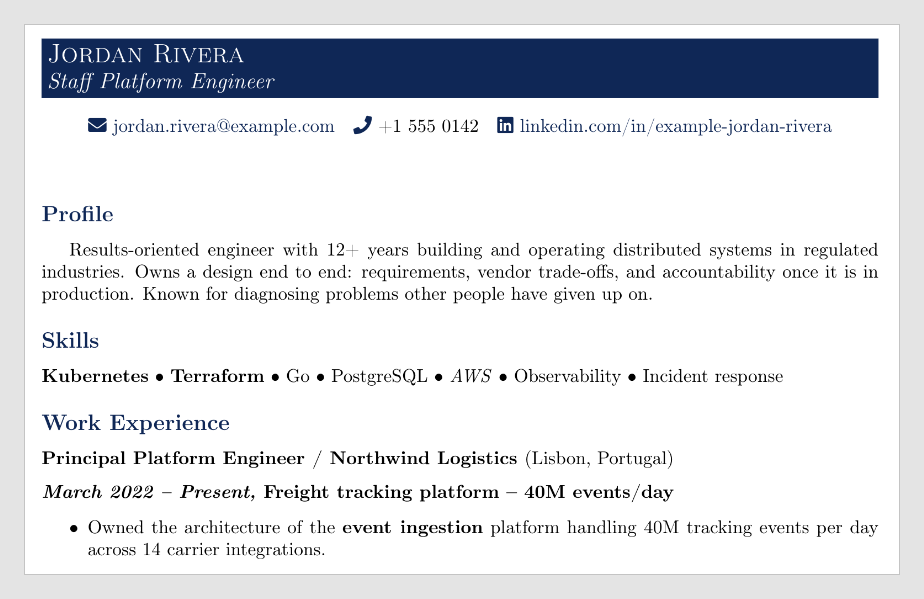
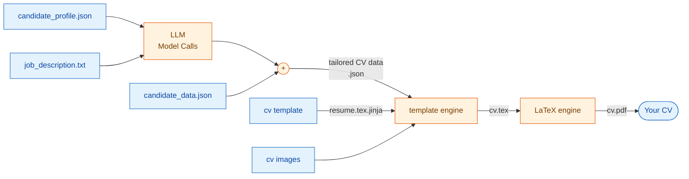

# Resumix

[](https://github.com/gcontini/resumix/actions/workflows/ci.yml)
[](LICENSE)

Turn a job description and your unstructured experiences into a tailored, two-page LaTeX CV and a cover letter, using any OpenAI-compatible model.

<details>
<summary>**CV Preview**</summary>



[**See what it produces →** `examples/sample_cv.pdf`](examples/sample_cv.pdf)
</details>

- **Analyses** the Job Description you select against your profile — match score, salary, seniority, skills, gaps (optional).
- **Writes** a CV tailored to the posting, reviewed against your profile for
  invented claims, condensed until it fits two pages, with matching keywords
  highlighted.
- **Renders** real LaTeX to a PDF, and optionally a cover letter.
- Watches your **clipboard** or a **folder**, or runs **once** on a single file.

You need to provide:
- A list of your work experiences, skills, the more you put the best it is (as long as you can defend it in an interview). You don't have to worry about writing them in a perfect style: it will fix it for you.
- Some customization data for the cv (your phone...)
   - Any image your template uses — a signature scan, a photo, a logo. Drop it
     in the folder and the template includes it by file name.
- The job description
- You api key and model configuration

## Will it work for me?

It started as my own personal lab to learn AI assisted coding. It's not tested across
different cv formats and sizes. It's sized for a well established professional with 
lots of experiences. I tried to make it "tunable", so you can fit your experiences.

## Download and run

resumix is two pieces: a server that holds the model keys and the LaTeX
toolchain, and a client executable you run on your machine. Neither needs the
other installed locally — the client talks to the server over HTTP.

**1. Run the server** — a container image, published on Docker Hub:

```bash
docker run -d -p 8080:8080 \
  -e MODEL_API_KEY=... \
  gcontini/resumix-server:latest
```

Any OpenAI-compatible provider works — see
[`server/README.md`](server/README.md) for the other providers and the full
environment table. `curl localhost:8080/healthz` should report `pdflatex: true`.

**2. Download the client** — a single executable, no Python required, from the
[releases page](https://github.com/gcontini/resumix/releases): pick
`resumix-linux-x86_64` or `resumix-windows-x86_64`, unpack it, and put your
own `candidate_profile.json` and `candidate_data.json` beside it (start from
the fictional set in the download's `examples/candidate/`).

```bash
./resumix --server http://localhost:8080 clipboard --out ~/applications
```

Copy a job posting to your clipboard; resumix checks it, shows you the
analysis, and on confirmation writes the CV into
`~/applications/cv/<day>/<Company>_<Title>/`. `watch` and `submit` work the
same way against files instead of the clipboard —
[`client/README.md`](client/README.md) covers all three modes, configuration,
and the output layout.

## Architecture

Below how the data you provide is merged to create the final CV:



You can download `"tailored CV data.json"` and `cv.tex` toghether with the final pdf, in case you want to modify something manually and resubmit them for rendering via the client.

Package boundaries, what crosses the wire, and the async job model are in
[doc/architecture.md](doc/architecture.md).

## Development

```bash
uv sync
uv run pytest                   # all four suites; no API key, no network
uv run resumix-api            # the server, from source
uv run resumix --help         # the client, from source
uv run --group docs mkdocs serve  # the documentation site, on :8000
```

Tests that need `pdflatex` skip themselves without it. The engineering rules
the code follows are in [AGENTS.md](AGENTS.md).

## Known limitations

- A CV job cannot be cancelled: an abandoned one holds a slot until its own
  budget runs out. See [PLANNED-FEATURES.md](PLANNED-FEATURES.md).
- A job id only means something to the instance holding its directory, so run
  one instance per `RESUMIX_WORK_DIR`.
- One template, one language. Bring your own `.tex.jinja` if you want a different shape.

## License

MIT — see [LICENSE](LICENSE).
