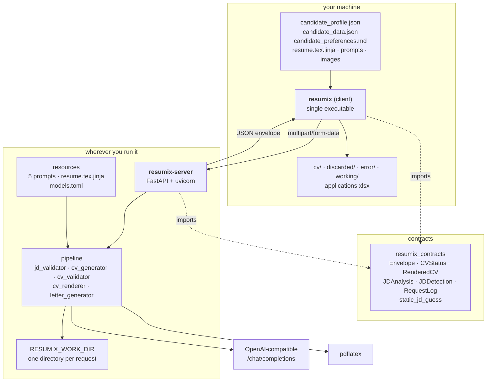
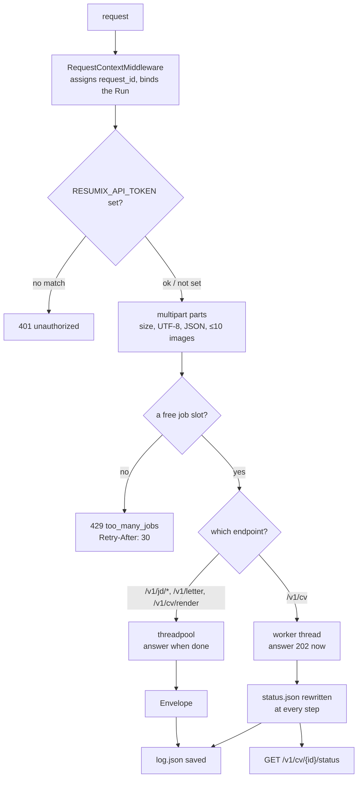

# Architecture

## The three packages



`client → contracts ← server`. Neither half imports the other, and
`tests/test_architecture.py` fails the build if one ever does. The contracts
package depends on pydantic and nothing else: it is loaded both by a web
server and by a frozen executable, and has to stay cheap in both.

| Package | Holds | Ships as |
|---|---|---|
| `client/` | Your profile, your contact data, your template and images, the output tree, the spreadsheet | A PyInstaller executable, ~1 file |
| `server/` | The provider API key, the five prompts, the LaTeX template, the LaTeX toolchain | A container image, ~780 MB |
| `contracts/` | The response envelope, the payload models, the free JD pre-check | A pydantic-only package, vendored into both |

## What crosses the wire

Everything personal arrives with the request and dies with it. The server has
no database, no accounts and no seeded state; the only thing it keeps is one
directory per request:

```text
$RESUMIX_WORK_DIR/<request_id>/
    status.json   a CV job's state — only CV jobs have one
    result.json   the finished RenderedCV — only once the job is done
    log.json      every line the request produced, model calls included
    work/         the scratch directory, deleted when the work ends
```

Writes are atomic (temp file + `os.replace`), because a poll may read a file
while the worker is rewriting it. The newest 200 directories are kept; the
rest are dropped, except one still marked `running`.

## Inside the server



- **One exception handler.** `describe_failure()` is the single place that
  decides what an exception produces on the wire, so a failure body has the
  same shape as a success: a `request_id`, `ok: false` and one line naming the
  kind and the stage. See [error model](protocol.md#errors).
- **One semaphore.** `RESUMIX_MAX_CONCURRENT_JOBS` (10) bounds requests in
  flight. A full server refuses immediately rather than queueing a caller for
  minutes.
- **The pipeline is a library.** Everything under `pipeline/` takes its inputs
  in memory and returns its outputs; it reads no configuration, resolves no
  paths and writes nothing outside the scratch directory it is handed. That is
  what makes it safe to run per request.
- **The LaTeX subprocess is sandboxed.** Shell escape off, reads and writes
  confined to the scratch directory, no stdin, a timeout, its own `HOME` and
  `TEXMFVAR`. A request may supply both the template and a whole `.tex`, so
  both are treated as hostile input.

## The four models

One provider, one API key, one endpoint — declared once in the `[provider]`
table of `resources/models.toml`. Four roles call it:

| Role | Used for | Shipped as |
|---|---|---|
| `summary` | JD detection, JD analysis, cover letters. The only role allowed server-side web search. | `qwen3.8-flash`, thinking on, low effort |
| `cv` | Writing the CV | `qwen3.8-max`, thinking on, 6500-token budget, strict JSON schema |
| `review` | Reviewing each CV against the master profile; answers in plain text, one violation per line | `qwen3.8-max`, thinking on, temperature 0, no JSON mode |
| `highlight` | The `**bold**` keyword pass over validated CV JSON | `qwen3.8-flash`, thinking **off** |

Provider differences are declared as capabilities (`web_search`, `thinking`,
`structured_output`), never branched on by name. Each role's `model`,
`temperature`, `thinking` and `structured_output` can be overridden with a
`RESUMIX_<ROLE>_<FIELD>` environment variable without editing the file.

Every model reply is re-validated: the JSON schema goes into the prompt *and*
into `response_format`, and the reply is parsed by pydantic. A weak
`response_format` costs a retry, never correctness.

## Asynchrony, and why

Writing a CV takes minutes. `POST /v1/cv` answers `202` with a job id and
hands the work to a plain thread that outlives the response; the thread
reports itself by rewriting `status.json`, and a poll reads a file. Nothing
is held open for minutes, and a client that walks away costs nothing but its
slot.

The consequences are worth knowing before you deploy:

- **A job id only means something to the instance holding its directory.** Run
  one instance per `RESUMIX_WORK_DIR`, or give several a shared root and
  route by request id.
- **`WEB_CONCURRENCY=1`.** The slots and the workers are per-process, and a
  starting process marks every job still marked `running` as failed — correct
  for its own orphans, wrong for a sibling's live jobs.
- **A job cannot be cancelled yet.** An abandoned one holds a slot until its
  own budget runs out (`RESUMIX_REQUEST_BUDGET_SECONDS`, 20 minutes).
  `PLANNED-FEATURES.md` describes the `DELETE /v1/cv/{id}` that fixes it.

## Observability

Every response carries a `request_id`, and so does the `X-Request-Id` header.
That id is the handle for `GET /logs/{request_id}`, which returns what the
server did — one line per model call with its duration and token counts.

Nothing else rides on a reply: the commentary is fetched separately, so the
common case pays nothing for it and the debugging case gets all of it. The
client folds it into `log.log` next to each CV — always on failure, and for
every call with `--debug`.
