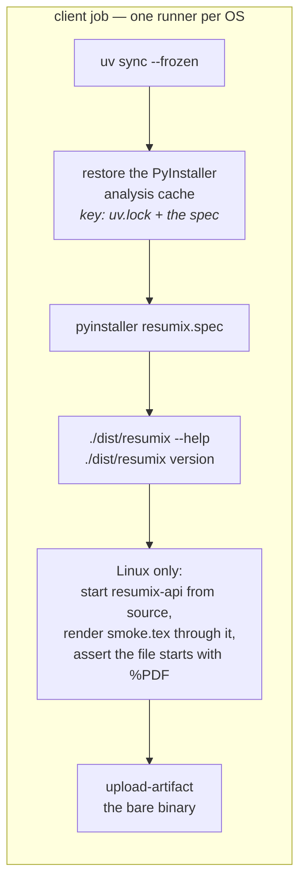

# Building the client

The client ships as a single executable — no Python on the user's machine, no
virtualenv, no install step.

```bash
uv sync
uv run --with pyinstaller pyinstaller --noconfirm client/packaging/resumix.spec
./dist/resumix --help
./dist/resumix version
```

That produces `dist/resumix` (or `dist/resumix.exe` on Windows).

## What the spec does

`client/packaging/resumix.spec`:

- **Entry point** is `client/packaging/entrypoint.py`, not
  `resumix_client/__main__.py`. PyInstaller runs its entry script as a
  top-level module, where `__main__.py`'s relative import has no package to
  resolve against.
- **Bundled data**: `applications.xlsx`, the empty spreadsheet copied on first
  use, and the package's own `.dist-info` via `copy_metadata`. `resumix
  version` reads `importlib.metadata`, and a frozen application has no metadata
  unless it is copied in — without it the binary prints `version unknown`.
  Everything else the client needs — your profile, your template, your images —
  it reads from the folder you run it in at runtime, which is the whole point.
- **Excludes**: `fastapi`, `uvicorn`, `starlette`, `openai`, `jinja2`,
  `pypdf`, `resumix_server`, `tkinter`, `pytest`. None of them belong in a
  client; excluding them keeps the binary small if one is ever pulled in
  transitively. `tests/test_architecture.py` enforces the same rule at the
  source level, so a bad import fails the test suite before it reaches the
  build.

**PyInstaller does not cross-compile.** Build each binary on the OS it is for.

Why PyInstaller and not Cython: Cython compiles modules to C extensions but
still needs an interpreter and a launcher around them, so it does not produce
the single file this is for. Nuitka would, and is the fallback if start-up
time or source opacity ever matters more than build simplicity.

## In CI



The smoke test is the part worth keeping: `--help` proves the binary starts,
but the real question is whether it *talks to a server*. `render` is the one
call that needs no model, so CI starts the server from the same checkout with
an invalid provider endpoint, renders a two-line `.tex` through the real
multipart → envelope → `pdflatex` → base64 path, and checks the bytes on disk.

The analysis cache is keyed on `uv.lock` **and** the spec, because either one
invalidates it; without it PyInstaller re-analyses every dependency from
scratch on each run.

## What a user downloads

A release is one flat `.tar.gz` holding both binaries and the files the client
looks for by name. How it is assembled, and how to cut one, is in
[Cutting a release](release.md).

## Running from source instead

```bash
uv sync
uv run resumix --help
uv run resumix --server http://localhost:8080 clipboard --out ~/applications
uv run pytest client/tests        # no server, no terminal, no network
```

The client's tests fake at the boundary: `ResumixApi` is a protocol, so the
modes run against a stub with no HTTP at all, and `tests/test_integration.py`
drives the real client against the real app in-process through an
`httpx.Client` — both halves, no socket.

## Adding a new way to feed it postings

A source of job descriptions is a `JDSource`: one method, yielding
`JDCandidate`s. `clipboard`, `watch` and `submit` are three sources over one
pipeline, so a fourth — an IMAP folder, a browser extension, a queue — is a
new file under `client/src/resumix_client/sources/`, a thin mode that wires
it up, and no change to `JobRunner` at all.
