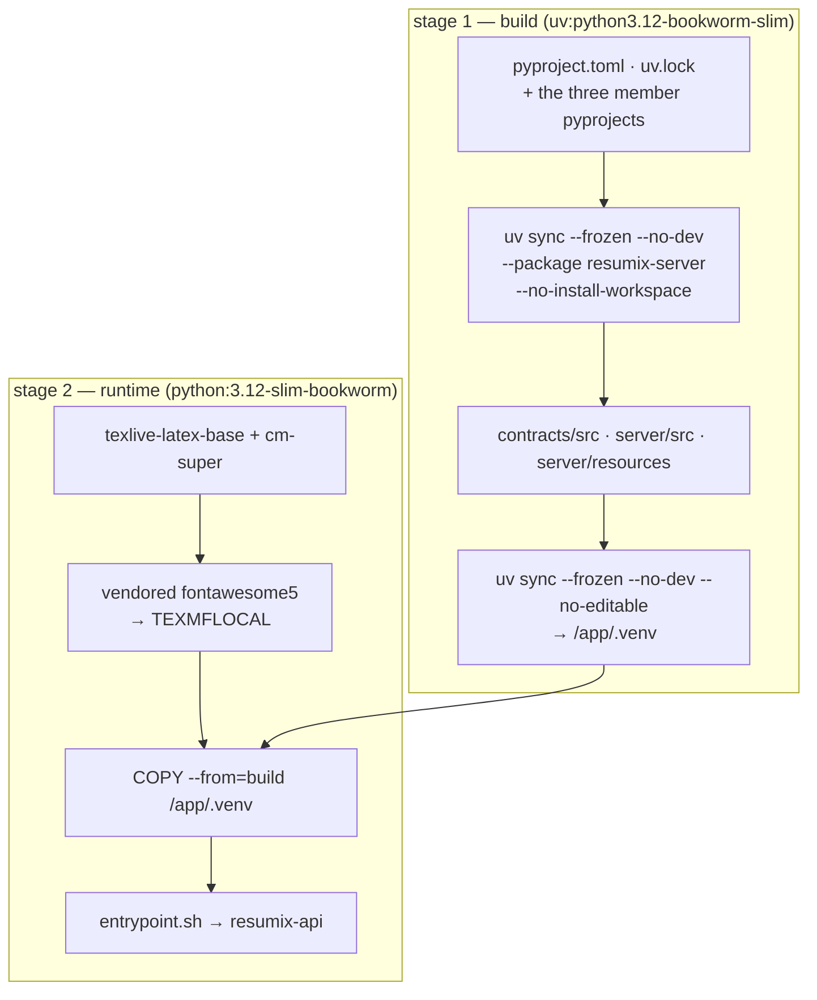

# Building the server

The server is a container image: a Python virtualenv, the LaTeX toolchain and
uvicorn. It mounts nothing and seeds nothing.

## Build it

```bash
cd <repo root>
DOCKER_BUILDKIT=0 docker build -t resumix-server .
```

**The `Dockerfile` lives at the repository root, not in `server/`**, because
some cloud builders refuse a Dockerfile in a subfolder. The build context is
the root: the image needs `contracts/` and `server/`, and nothing else.

**Classic builder only.** No BuildKit features and no heredocs — CI builds
with `DOCKER_BUILDKIT=0` on purpose, and the image must stay buildable that
way.



Why the layers are in that order: the lock file changes rarely and the code
changes every commit, so dependencies resolve in a layer of their own.
`--no-editable` copies the packages into the venv instead of linking them back
to `/app/src`, so the runtime stage needs nothing but the venv.

### What the LaTeX bits are for

| Package | Why |
|---|---|
| `texlive-latex-base` | `hyperref`, `graphicx`, `array`, `hhline`, `amsmath`, `babel-english` — everything `resume.tex.jinja` uses |
| `cm-super` | Type 1 CM fonts. Without them, T1 encoding falls back to bitmap fonts and the PDF looks scanned. `cm-super-minimal` is not enough: it leaves the design sizes the CV uses for headings and small print as Type 3 bitmaps |
| `fontawesome5` (vendored) | The contact icons in the CV header. Debian ships it only inside the 1.7 GB `texlive-fonts-extra`, so it is vendored as a TeX Live archive in `server/docker/vendor/` and unpacked into `TEXMFLOCAL`. No network access during the build |

The image is ~780 MB, almost all of it that toolchain.

## Run it

```bash
docker run --rm -p 8080:8080 --env-file .env resumix-server
curl localhost:8080/healthz          # expect "pdflatex": true
```

It runs as any uid (`--user "$(id -u):$(id -g)"`), needs no volume, and works
with a read-only root filesystem as long as `/tmp` is writable **and
executable**:

```bash
docker run --read-only --tmpfs /tmp:exec -p 8080:8080 --env-file .env resumix-server
```

`exec` on that tmpfs is required: `pdflatex` writes and then reads back its
font cache there. A tmpfs also means finished CVs do not survive a restart —
mount a volume at `RESUMIX_WORK_DIR` if you want them to.

`server/compose.yaml` does all of the above with the settings already wired:

```bash
cp .env.example .env     # then fill in one provider's API key
cd server && docker compose up --build
```

The published image is on Docker Hub:

```bash
docker run -d -p 8080:8080 -e MODEL_API_KEY=... lmstch/resumix:latest
```

`:latest` and `:x.y.z` are pushed by the release workflow, not by hand — see
[Cutting a release](release.md). Pin the version tag if you want the server to
stay where the client you handed out expects it.

## Configure it

### The provider

Three model roles, one provider, one API key. The endpoint is declared once in
the `[provider]` table of `resources/models.toml`; the key comes from the
environment.

```bash
MODEL_API_KEY=sk-...
MODEL_BASE_URL=https://dashscope-intl.aliyuncs.com/compatible-mode/v1
```

Any OpenAI-compatible `/chat/completions` endpoint works — OpenAI, DeepSeek, a
local Ollama. Switching providers is replacing those two values; `models.toml`
names the same two variables and does not need to change.

Per-role overrides need no rebuild either — `RESUMIX_<ROLE>_<FIELD>` for
`SUMMARY`, `CV`, `REVIEW` and `HIGHLIGHT`:

```bash
RESUMIX_CV_MODEL=qwen-max
RESUMIX_CV_TEMPERATURE=0.2
RESUMIX_CV_THINKING=off            # auto | on | off
RESUMIX_CV_STRUCTURED_OUTPUT=json_object
```

### Environment

| Variable | Default | What it does |
|---|---|---|
| `MODEL_API_KEY` | — | The provider key. Without it the server starts but every model call fails |
| `MODEL_BASE_URL` | DashScope intl. | The OpenAI-compatible endpoint |
| `PORT` / `HOST` | `8080` / `0.0.0.0` | Where uvicorn listens |
| `WEB_CONCURRENCY` | `1` | uvicorn worker processes. **Keep it at 1** per work root |
| `RESUMIX_KEEPALIVE` | `75` | uvicorn keep-alive timeout, seconds |
| `RESUMIX_API_TOKEN` | unset | Bearer token clients must send. **Unset means no auth** |
| `RESUMIX_RESOURCES` | baked in | Directory of replacement prompts / template / `models.toml` |
| `RESUMIX_WORK_DIR` | system temp | One directory per request: scratch, log, and a CV job's state and result |
| `RESUMIX_MAX_CONCURRENT_JOBS` | `10` | Requests in flight; the rest get `429` |
| `RESUMIX_LATEX_TIMEOUT` | `120` | Seconds before a compile is killed |
| `RESUMIX_REQUEST_BUDGET_SECONDS` | `1200` | Wall clock for one CV run before `504` |
| `RESUMIX_MAX_ATTEMPTS` | `4` | Generate → review → page-check rounds |
| `RESUMIX_MAX_PART_BYTES` | `2000000` | Cap on any one uploaded part |
| `RESUMIX_JD_MIN_CHARS` / `_MAX_CHARS` | `1000` / `10000` | Length band for the free JD check |
| `RESUMIX_LOG_LEVEL` | `INFO` | Logging level |

### Prompts and the template

The five prompts and `resume.tex.jinja` ship inside the image. To change them
permanently, mount a directory with your versions and set
`RESUMIX_RESOURCES`; anything missing there falls back to the built-in copy.
To change them for one request, upload them as parts — that is what the client
does when it finds them next to its executable.

```bash
docker run -p 8080:8080 --env-file .env \
  -v "$PWD/my-resources:/resources:ro" -e RESUMIX_RESOURCES=/resources \
  resumix-server
```

## From a checkout

```bash
uv sync
uv run resumix-api            # http://localhost:8080
uv run pytest server/tests      # no API key, no network
uv run pytest                   # every package, plus the integration test
```

The LaTeX-dependent tests skip themselves when `pdflatex` is absent. Nothing
in the suite calls a model: `server/tests/server_helpers.py` wires a real
`ModelSelector` to a fake HTTP client, so request assembly, structured-output
negotiation and usage logging are all the production code paths.
`server/tests/golden/cv_golden.tex` pins the whole render — an escaping
regression is otherwise invisible until someone reads a bad PDF.

## Deploying

A CV job runs for minutes after the request that started it has been answered.
That is the one thing to plan around.

- **`RESUMIX_WORK_DIR` is state.** A job's status, its result and every
  request's log live there. The default is the system temp directory, which on
  most container platforms is RAM-backed and empty again after a redeploy —
  fine, because a client collects its CV within the minute. Mount a volume
  only if you want results to outlive a restart.
- **One process per work root.** The job slots and the worker threads are
  per-process, and a starting process marks every job still marked `running`
  as failed — right for its own orphans, wrong for a sibling's live jobs.
- **Request timeouts barely matter now.** Every call returns in seconds; only
  `/v1/cv/render` waits on a compile. What must outlast
  `RESUMIX_REQUEST_BUDGET_SECONDS` is the client's willingness to keep
  polling.
- **Size for the compiles, not the waiting.** Ten jobs in flight is the
  default; each is mostly idle on the provider, but each also compiles LaTeX
  several times.
- **Scaling.** A job id only means something to the instance that has its
  directory: run one instance, or give several a shared work root and route by
  request id.
- **Cold starts** build three HTTP clients and read six files. Fast — but the
  first request also warms the LaTeX font cache in `/tmp`.

### Sandboxing

A request may supply the LaTeX template, and `/v1/cv/render` accepts a whole
`.tex`. That is arbitrary LaTeX, so every compile runs with shell escape
disabled (`-no-shell-escape`, `shell_escape=f`), reads and writes confined to
the scratch directory (`openin_any=p`, `openout_any=p`), no stdin to block on,
a timeout, and its own `HOME`/`TEXMFVAR`. The scratch directory is deleted
when the request ends, and the scratch path is scrubbed out of any LaTeX log
that goes back to a client.

## In CI

`.github/workflows/ci.yml` has three jobs. The `image` one builds with
`DOCKER_BUILDKIT=0`, starts the container with a deliberately invalid provider
endpoint, and asserts `/healthz` reports `"pdflatex":true` — the image is
checked for the toolchain, not for a model.

`.github/workflows/release.yml` builds it the same way — classic builder,
`linux/amd64` — and adds one assertion before it pushes: that `/healthz`
reports the version being released. The server reads its version from the
installed package metadata, which the image builds with `--no-editable`, so
that check is what proves the number on the Docker Hub tag is the number the
container will report.
