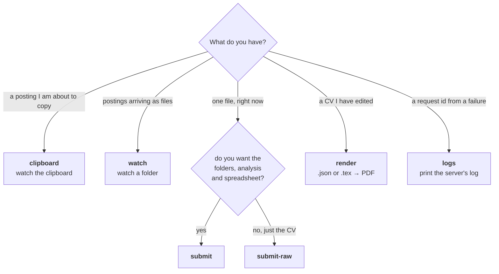
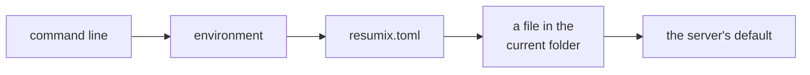

# The client

One executable, six modes. It keeps your CV data on your machine and sends it,
per request, to a server that holds the model API keys and the LaTeX
toolchain. No Python, no API key and no LaTeX install of your own.

```text
resumix [global options] MODE [mode options]
```

Global options work on either side of the mode name: `resumix -v submit
posting.txt --out ~/applications` and `resumix submit -v …` do the same
thing.

## Which mode



| Mode | Asks before spending | Detects + analyses | Writes the folder tree | Spreadsheet | Cover letter |
|---|---|---|---|---|---|
| `clipboard` | yes (or `--yes`) | yes | yes | yes | optional |
| `watch` | yes (or `--yes`) | yes | yes | yes | optional |
| `submit` | yes (or `--yes`) | yes | yes | yes | optional |
| `submit-raw` | **no** | no | no | no | no |
| `render` | no — costs no model call | no | no | no | no |
| `logs` | no | no | no | no | no |

## The modes

### `clipboard` — copy a posting, get a CV

```bash
resumix clipboard --out ~/applications
```

Watches the clipboard. When you copy something that looks like a posting, it
checks with the server, analyses it, prints the analysis and asks:

```text
Paste the posting URL to submit, y = submit without link, s = skip, q = quit
> https://jobs.example.com/12345
```

Then it writes the CV, renders the PDF and files everything. Ctrl+C to stop.
Anything left in `working/` by a previous run is offered back to you at
startup: *resume*, *clean* or *quit*.

On Linux the clipboard needs a helper — `apt install xclip` (X11) or
`wl-clipboard` (Wayland) — and a reachable `DISPLAY`/`WAYLAND_DISPLAY`. The
client probes it at startup and tells you if it cannot read it, instead of
waiting forever for a change that can never arrive. Over SSH, forward X11 or
use `watch`, which needs no clipboard at all.

### `watch` — drop files into a folder

```bash
resumix watch --in ~/Downloads/postings --out ~/applications
```

Every file dropped into `--in` is **claimed immediately** — moved into
`working/` under a timestamp — so nothing is ever processed twice and a crash
leaves it somewhere recoverable. A file still being copied in is left alone
until its size stops changing. One posting at a time, because each one asks
you a question.

`--in` defaults to `./incoming`, created if missing. It may not be the same
folder as `--out`.

### `submit` — one file, once

```bash
resumix submit posting.txt --out ~/applications --yes
```

The same pipeline for a single file, then it exits. No recovery prompt: a
one-off run must not start by asking about someone else's leftovers. The file
you name is **copied**, not consumed — unlike `watch`, which empties the
folder it watches.

### `submit-raw` — just the CV, right here

```bash
resumix submit-raw posting.txt
resumix submit-raw posting.txt -o cv.pdf -o cv.json -o cv.tex
```

The CV and nothing else: no detection, no analysis, no question before
spending, no cover letter, no spreadsheet, no folders. Files land in the
directory you are standing in.

`-o` is repeatable and the suffix is the whole instruction — `.pdf` writes the
PDF, `.json` the document, `.tex` the LaTeX. A name you chose is overwritten
without asking, because a name you chose is a name you meant. With no `-o` you
get one PDF named after the posting (`posting.txt` → `posting.pdf`), and a
second run counts up to `posting_1.pdf` rather than replacing it.

### `render` — compile an edited CV

```bash
resumix render ~/applications/cv/26-01-15/Acme_Head_of_IT/cv_Jordan_Rivera.json
resumix render cv_Jordan_Rivera.tex --output /tmp/preview.pdf
```

Give it the `.json` document to re-render from the content, or the `.tex` to
compile a hand-edit. The PDF lands next to the input unless `--output` says
otherwise. Needs no profile and no posting — just the server — and costs one
LaTeX compile and no model call. A failed render prints the server's log for
that request, which is where the LaTeX error is.

### `logs` — what the server did

```bash
resumix logs b510f8dff047
```

Every failure names a request id; this is the other half of that. It prints
that request's server-side log — each model call with its duration and token
counts, and the error that ended it. The server keeps the last couple of
hundred requests, so ask reasonably soon; a pruned id gives `404`.

## Options

### Global

| Flag | What it does |
|---|---|
| `--server URL` | The resumix server. Default `http://localhost:8080`. |
| `--token TOKEN` | Bearer token, if the server requires one. |
| `--temperature F` | Sampling temperature override, passed to the server. |
| `--pages N` | Page limit the CV must fit. Default: the server's, which is 2. |
| `--config FILE` | Use this `resumix.toml` instead of searching for one. |
| `--data-dir DIR` | Look for your files here before the current folder. |
| `-d`, `--debug` | Fetch the server's log after **every** call and fold it into `log.log`. Without it, only failures are fetched. |
| `-v`, `--verbose` | Print what the server reports about each finished step — tokens, thinking tokens, elapsed, and the reviewer's or the page check's own words — plus the request id and the `/healthz` attempts. |

### Per mode

| Flag | Modes | What it does |
|---|---|---|
| `--out DIR` | clipboard, watch, submit | The output folder (`working/`, `error/`, `discarded/`, `cv/`). Default: the current folder. |
| `--in DIR` | watch | The folder to watch. Default: `./incoming`, created if missing. |
| `--cover-letter no\|yes\|letter_only` | clipboard, watch, submit | Also write a cover letter, or write *only* one. Default `no`. |
| `--yes` | clipboard, watch, submit | Submit every valid posting without asking. Unattended runs spend tokens on their own. |
| `--no-xlsx` | clipboard, watch, submit | Do not record delivered CVs in the spreadsheet. |
| `--resume REQUEST_ID` | submit, submit-raw | Pick up a CV job already running on the server instead of submitting a new one: start from its `/status`. For a job whose answer never came back. |
| `-o FILE` | submit-raw | Write one output here: `.pdf`, `.json` or `.tex`. Repeatable. |
| `--output FILE` | render | Where to write the PDF. Default: beside the input. |

Exit code is `0` when nothing failed, `1` when a posting failed or the client
could not start (a missing file, an unreachable server, a bad config).

## Configuration

Everything resolves in this order:



### `resumix.toml`

Looked for as `--config`, then `$RESUMIX_CONFIG`, then `resumix.toml` in
the current folder.

```toml
server_url   = "https://resumix.example.run.app"
token        = "the-bearer-token"   # only if the server requires one
cover_letter = "no"                 # no | yes | letter_only
# temperature = 0.4                 # passed to the server
# pages       = 2                   # page limit the CV must fit
# timeout     = 1800                # seconds to keep polling one CV job
# debug       = true                # same as -d on every run
# verbose     = true                # same as -v on every run

[files]                             # explicit paths win over discovery
# profile        = "~/cv/candidate_profile.json"
# candidate_data = "~/cv/candidate_data.json"
# preferences    = "~/cv/candidate_preferences.md"
# template       = "~/cv/resume.tex.jinja"
# prompt_cv      = "~/cv/sys_prompt_cv.txt"
# prompt_highlight = "~/cv/sys_prompt_highlight.txt"
# prompt_review    = "~/cv/sys_prompt_review.txt"
# prompt_letter    = "~/cv/sys_prompt_letter.txt"
```

A relative path under `[files]` is resolved against the config file's own
folder, and a path that does not exist is an error rather than a silent
fallback. The keys are short on purpose: TOML reads
`candidate_profile.json = "x"` as a dotted key, which is not what anyone
means.

### Environment

| Variable | What it does |
|---|---|
| `RESUMIX_API_URL` | The server URL. Beaten by `--server`. |
| `RESUMIX_API_TOKEN` | The bearer token. Beaten by `--token`. |
| `RESUMIX_CONFIG` | Path to `resumix.toml`. Beaten by `--config`. |

### Your files

Put them in the folder you run from (or in `--data-dir`) and they are picked
up by name:

| File | What it is | Required |
|---|---|---|
| `candidate_profile.json` | Everything you have ever done. The model tailors the CV from this — the more complete, the better. | **yes** |
| `candidate_data.json` | Name, email, phone, LinkedIn, languages, location, education. Printed by the template as-is; no model is shown it. | **yes** |
| `candidate_preferences.md` | What you want from a job, in prose. Scored against each posting. | for analysis |
| `resume.tex.jinja` | Your own LaTeX template. | no — the server's is used |
| `sys_prompt_cv.txt`, `sys_prompt_highlight.txt`, `sys_prompt_review.txt`, `sys_prompt_letter.txt` | Your own prompts. | no — same |

Every `.png`, `.jpg` and `.jpeg` in those folders is sent too, under its own
file name — and that name is the whole contract: the server writes each one
next to the `.tex`, so `\includegraphics{photo.jpg}` in your template is
satisfied by a `photo.jpg` sitting next to you. At most 10 per request.
`candidate_signature.png` is just one such image: the stock template includes
it, and the server has a blank one if you do not.

Start from the fictional set in the repository's `examples/candidate/`.

## What you get

```text
~/applications/
├── cv/
│   └── 26-01-15/
│       └── Acme_Corp_Head_of_IT/
│           ├── cv_Jordan_Rivera.pdf     the CV
│           ├── cv_Jordan_Rivera.tex     the LaTeX it was compiled from
│           ├── cv_Jordan_Rivera.json    the content, for re-rendering
│           ├── analysis.json            match score, salary, skills, gaps
│           ├── jd.txt                   the posting (or its original filename)
│           ├── cover_letter.txt         with --cover-letter
│           └── log.log                  every step, plus the server's on failure
├── discarded/26-01-15/…                 postings you said no to, analysis kept
├── error/26-01-15-09-30-00_notes.txt    rejected or failed, with a .log beside it
├── working/                             in flight; empty when nothing is running
└── applications.xlsx                    one row per delivered CV
```

File names come from your own `candidate_data.json`, not from the server.

To revise a CV: edit `cv_Jordan_Rivera.json` and run `resumix render` on it —
one LaTeX compile, no model calls. Editing the `.tex` and rendering that works
too. The spreadsheet's own header row is the schema: rename, reorder or add
columns in your copy and the rows follow.

`log.log` holds the client's steps, and the server's account of each request
on failure (or on every call with `--debug`):

```text
2026-01-15T09:30:12 ✍ writing the CV (this takes minutes)...
--- server request b510f8dff047 ---
  2026-01-15T09:30:53 INFO    [cv.generate]   [cv] qwen-max 41.2s | prompt=7104, completion=1832, thinking=903
  2026-01-15T09:31:03 INFO    [cv.review]     [cv] qwen-max 9.8s | prompt=5210, completion=96
```

One line per model call is what it cost.

## What leaves your machine

Per request: the posting text, your `candidate_profile.json`, your
`candidate_preferences.md` (for the analysis), your `candidate_data.json` and
every image in the folder. Whether *the model provider* keeps what it is shown
is between you and whoever runs the server — the same question as with any
hosted model.

**No model is ever shown your `candidate_data.json`.** It is sent because the
server compiles the CV to count its pages, and a page count taken with the
contact block missing is not the page count of the CV you will send; it goes
to the LaTeX template and nowhere else.

Nothing at all is sent for text that fails the local length and binary checks,
so a copied password or a screenful of code never leaves the machine. The
server holds a finished CV in a directory of its own until a couple of hundred
newer requests have pushed it out, and keeps nothing else.

## Troubleshooting

| What you see | What to do |
|---|---|
| `cannot reach the resumix server at …` | The server is down or the URL is wrong. `curl <url>/healthz` to check. |
| `did not come up after 3 attempts` | The server was unreachable on three tries two seconds apart — a cold container may need longer; try again. |
| `401` / `a valid bearer token is required` | The server wants a token: set `token` in `resumix.toml` or pass `--token`. |
| `candidate_profile.json is required but was not found` | Put it in the current folder, or name it under `[files]`. |
| `no clipboard here: neither DISPLAY nor WAYLAND_DISPLAY…` | Install `xclip` or `wl-clipboard`, or use `watch`. |
| `429` / `all job slots are busy` | The server is at capacity. Try again shortly. |
| `clipboard: not a posting (412 chars, nothing sent)` | What you copied is a fragment. Nothing was sent anywhere. |
| A posting you wanted lands in `error/` | Read the `.log` beside it. A wrong "not a job description" verdict usually means the copy grabbed only part of the page. |
| You need more than the error line | Re-run with `-d`, or `resumix logs <request id>` while the server still has it. |
| `working/` is not empty | A previous run stopped mid-job. `clipboard` and `watch` offer to resume or clean at startup. |
| The client died but the job was running | `resumix submit posting.txt --resume <request_id>` picks it back up. |
