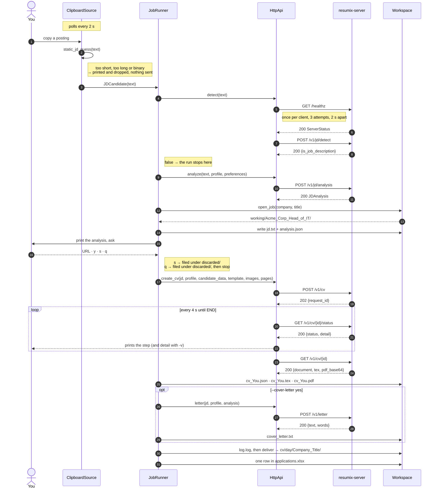
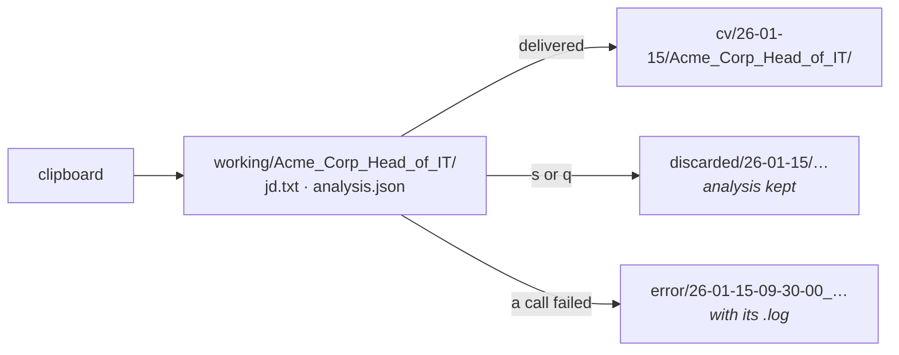

# A run, end to end

One posting, from the moment you press Ctrl+C on a job ad to the folder that
holds the PDF. This is `resumix clipboard`; `watch` and `submit` differ only
in what hands the runner the next posting.

## The call sequence

## The same run, as state on disk

A job is assembled under `working/` and moved into place in one step when it
is finished, so a folder under `cv/` is never half-written. `Workspace` owns
every path and every move; nothing else in the client builds a path by hand.

## Step by step

**1 — The free check runs on your machine.** `static_jd_guess` lives in
`contracts/` precisely so both sides run the same one: the client uses it
before spending a network call, the server before spending a model call.
Copying a password or a line of code never reaches the network, and the
terminal says so: `clipboard: not a posting (412 chars, nothing sent)`.

**2 — `/healthz` before the first real call.** A freshly started server (a
cold container, a scale-to-zero platform) can take a moment to answer, so the
client knocks up to three times, two seconds apart, once per process — not
once per call. With `-v` it narrates the attempts.

**3 — Detection costs one small model call.** `POST /v1/jd/detect` answers
`{"is_job_description": true|false}`. *Why* something was rejected is in the
server's log for that request, not in the answer — a caller only ever branches
on the verdict. A false verdict on a posting you wanted usually means the copy
grabbed only part of the page.

**4 — Analysis creates the folder.** The company name and job title in the
`JDAnalysis` are what the folder is named after, so the folder cannot exist
before the analysis does. `jd.txt` and `analysis.json` are written
immediately: from here on, a crash is recoverable — `working/` is scanned at
the next startup and you are offered *resume* or *clean*.

**5 — The question is the only thing standing between you and the bill.**
Everything before it costs one or two small model calls; everything after it
costs minutes of the large one. Answer with the posting URL and it is stored
in `analysis.json` (and in the spreadsheet); `y` submits without one; `s`
skips; `q` stops the whole run. `--yes` answers for you, with the URL the
analysis found if it found one.

**6 — The CV job is polled, not waited on.** `POST /v1/cv` returns `202` and a
request id at once. The client polls `/status` every four seconds, printing
each new step; with `-v` it also prints `detail` — the token spend of the step
that just finished, and the reviewer's or the page check's own words. When the
status reads `END` it collects the document, the LaTeX and the PDF in one
call.

If the client dies mid-job, the job does not: the server keeps writing. Pick
it back up with `resumix submit posting.txt --resume <request_id>`, which
skips submitting and starts from `/status`.

**7 — A folder that already holds its document is re-rendered, not rewritten.**
If `cv_You.json` is already in the job folder, `_cv` posts it to
`/v1/cv/render` instead of starting a job: one LaTeX compile, no model call.
That is the whole recovery story — edit the JSON, drop the folder back, pay
nothing to a model.

**8 — Failure is filed, not printed and lost.** Every failure carries a
`request_id`; the client always fetches `GET /logs/{request_id}` for it and
folds the server's account into the job's `log.log`, then moves the job to
`error/`. With `--debug` it fetches that log after every call, successful or
not.

**9 — The spreadsheet is bookkeeping, never a reason to fail.** A locked or
broken `applications.xlsx` becomes a warning line in `log.log`; the CV was
paid for and stays delivered.

## Where each step lives in the code

| Step | Module |
|---|---|
| Polling the clipboard, the free check | `client/src/resumix_client/sources/clipboard.py` |
| The order of the steps | `client/src/resumix_client/runner.py` |
| Every HTTP call, and nothing else | `client/src/resumix_client/api.py` |
| Submitting and following a CV job | `client/src/resumix_client/cvjob.py` |
| Paths, moves, recovery | `client/src/resumix_client/workspace.py` |
| The analysis table and the question | `client/src/resumix_client/ui.py` |
| `log.log` | `client/src/resumix_client/joblog.py` |
| `applications.xlsx` | `client/src/resumix_client/tracking.py` |
