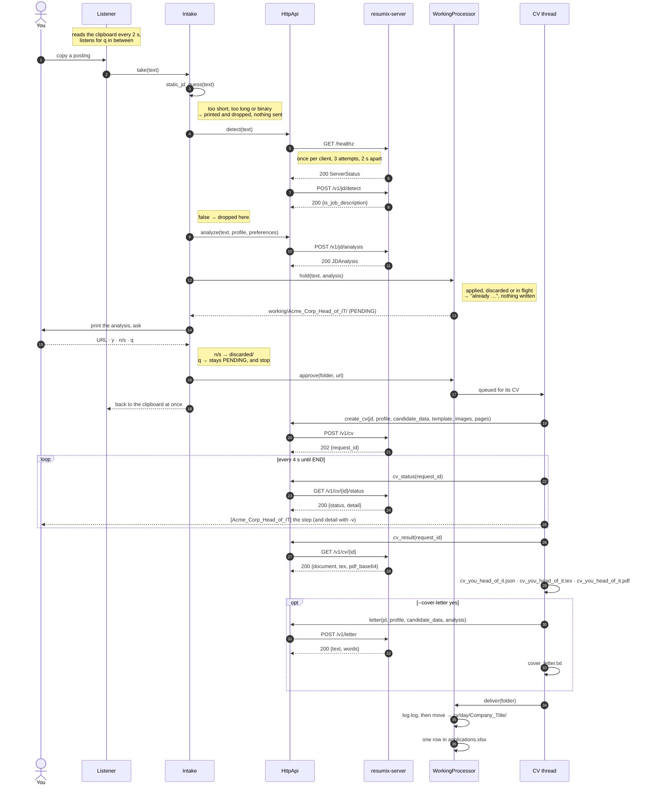
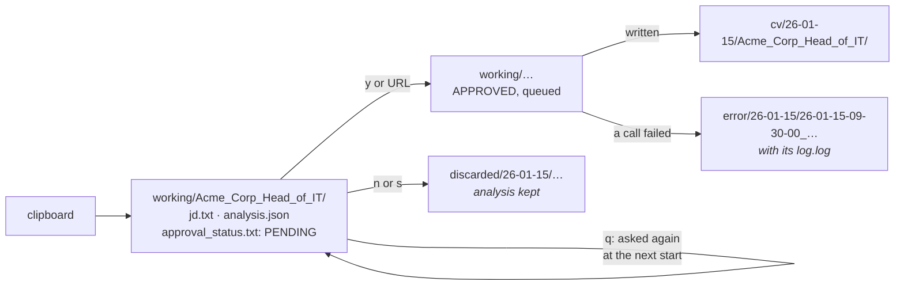

# A run, end to end

One posting, from the moment you press Ctrl+C on a job ad to the folder that
holds the PDF. This is `resumix clipboard`. `submit` runs the same steps once,
for one file, and writes the CV on the main thread before it returns. `watch`
reads postings from a folder and asks only about the CHECK ones — see
[the client guide](client.md).

## The call sequence

```mermaid
sequenceDiagram
    autonumber
    actor You
    participant Lis as Listener
    participant In as Intake
    participant Api as HttpApi
    participant Srv as resumix-server
    participant Wp as WorkingProcessor
    participant Gen as CV thread

    Note over Lis: reads the clipboard every 2 s,<br/>listens for q in between

    You->>Lis: copy a posting
    Lis->>In: take(text)
    In->>In: static_jd_guess(text)
    Note right of In: too short, too long or binary<br/>→ printed and dropped, nothing sent

    In->>Api: detect(text)
    Api->>Srv: GET /healthz
    Note right of Api: once per client, 3 attempts, 2 s apart
    Srv-->>Api: 200 ServerStatus
    Api->>Srv: POST /v1/jd/detect
    Srv-->>Api: 200 {is_job_description}
    Note right of In: false → dropped here

    In->>Api: analyze(text, profile, preferences)
    Api->>Srv: POST /v1/jd/analysis
    Srv-->>Api: 200 JDAnalysis
    In->>Wp: hold(text, analysis)
    Note right of Wp: applied, discarded or in flight<br/>→ "already …", nothing written
    Wp-->>In: working/Acme_Corp_Head_of_IT/ (PENDING)

    In->>You: print the analysis, ask
    You-->>In: URL · y · n/s · q
    Note right of In: n/s → discarded/<br/>q → stays PENDING, and stop
    In->>Wp: approve(folder, url)
    Wp->>Gen: queued for its CV
    In-->>Lis: back to the clipboard at once

    Gen->>Api: create_cv(jd, profile, candidate_data, template, images, pages)
    Api->>Srv: POST /v1/cv
    Srv-->>Api: 202 {request_id}

    loop every 4 s until END
        Gen->>Api: cv_status(request_id)
        Api->>Srv: GET /v1/cv/{id}/status
        Srv-->>Api: 200 {status, detail}
        Gen-->>You: [Acme_Corp_Head_of_IT] the step (and detail with -v)
    end

    Gen->>Api: cv_result(request_id)
    Api->>Srv: GET /v1/cv/{id}
    Srv-->>Api: 200 {document, tex, pdf_base64}
    Gen->>Gen: cv_you_head_of_it.json · cv_you_head_of_it.tex · cv_you_head_of_it.pdf

    opt --cover-letter yes
        Gen->>Api: letter(jd, profile, candidate_data, analysis)
        Api->>Srv: POST /v1/letter
        Srv-->>Api: 200 {text, words}
        Gen->>Gen: cover_letter.txt
    end

    Gen->>Wp: deliver(folder)
    Wp->>Wp: log.log, then move → cv/day/Company_Title/
    Wp->>Wp: one row in applications.xlsx
```

## The same run, as state on disk

```mermaid
flowchart LR
    CLIP["clipboard"] --> HELD["working/Acme_Corp_Head_of_IT/<br/>jd.txt · analysis.json<br/>approval_status.txt: PENDING"]
    HELD -->|"y or URL"| QUEUED["working/…<br/>APPROVED, queued"]
    HELD -->|"q: asked again<br/>at the next start"| HELD
    HELD -->|"n or s"| DISC["discarded/26-01-15/…<br/><i>analysis kept</i>"]
    QUEUED -->|"written"| CV["cv/26-01-15/Acme_Corp_Head_of_IT/"]
    QUEUED -->|"a call failed"| ERR["error/26-01-15/26-01-15-09-30-00_…<br/><i>with its log.log</i>"]
```

A job is assembled under `working/` and moved into place in one step when it
is finished, so a folder under `cv/` is never half-written. `Workspace` owns
every path and every move; `WorkingProcessor` is the only thing that asks it
to make one.

## Step by step

**1 — The free check runs on your machine.** `static_jd_guess` lives in
`contracts/` precisely so both sides run the same one: the client uses it
before spending a network call, the server before spending a model call.
Copying a password or a line of code never reaches the network, and the
terminal says so: `[clipboard] ✗ not a job description (412 chars, nothing sent)`.

**2 — `/healthz` before the first real call.** A freshly started server (a
cold container, a scale-to-zero platform) can take a moment to answer, so the
client knocks up to three times, two seconds apart, once per process — not
once per call. With `-v` it narrates the attempts.

**3 — Detection costs one small model call.** `POST /v1/jd/detect` answers
`{"is_job_description": true|false}`. *Why* something was rejected is in the
server's log for that request, not in the answer — a caller only ever branches
on the verdict. A false verdict on a posting you wanted usually means the copy
grabbed only part of the page.

**4 — Analysis creates the folder, unless the posting was seen before.** The
company name and job title in the `JDAnalysis` are what the folder is named
after, so the folder cannot exist before the analysis does. First every
`analysis.json` under `cv/`, `discarded/` and `working/` is compared with the
new one: a posting already applied to, discarded or still in flight is
dropped with the earlier folder's path, and nothing is written. Otherwise
`jd.txt`, `analysis.json` and `approval_status.txt` saying `PENDING` are
written at once.

**5 — The question is the only thing standing between you and the bill.**
Everything before it costs one or two small model calls; everything after it
costs minutes of the large one. You are asked about every posting, whatever
its `should_apply` says. Answer with the posting URL and it is stored in
`analysis.json` (and in the spreadsheet); `y` submits without one; `n` or `s`
files it under `discarded/`; `q` stops, and leaves the posting `PENDING` in
`working/`. `--yes` answers for you, with the URL the analysis found if it
found one.

**6 — The CV is written in the background.** Saying yes writes `APPROVED` and
queues the folder; the CV thread takes one folder at a time, and the
clipboard is read again at once, so you read the next posting while the last
one's CV is written. Its lines are tagged with the folder's name, and held
back while a question is on screen. `q` between postings lets the CV being
written finish; the approved ones still queued stay in `working/`.

**7 — The CV job is polled, not waited on.** `POST /v1/cv` returns `202` and a
request id at once. The client polls `/status` every four seconds, printing
each new step; with `-v` it also prints `detail` — the token spend of the step
that just finished, and the reviewer's or the page check's own words. When the
status reads `END` it collects the document, the LaTeX and the PDF in one
call.

If the client dies mid-job, the job does not: the server keeps writing. Pick
it back up with `resumix submit posting.txt --resume <request_id>`, which
skips submitting and starts from `/status`.

**8 — The next start picks up where this one stopped.** Anything left in
`working/` is offered back at startup: *resume*, *clean* or *quit*. Resume
sends each folder where its own files say: `APPROVED` to the CV thread,
`PENDING` to you before anything new is read, and a folder that already holds
its document (`cv_you_head_of_it.json`) is posted to `/v1/cv/render` instead
of starting a job — one LaTeX compile, no model call.

**9 — Failure is filed, not printed and lost.** Every failure carries a
`request_id`. Once the job has a folder, the client fetches
`GET /logs/{request_id}` for it, folds the server's account into the job's
`log.log`, then moves the job to `error/`. A detection or analysis that fails
has no folder yet: its request id is printed, and `resumix logs <request_id>`
shows what the server did. With `--debug` the client fetches that log after
every call, successful or not.

**10 — The spreadsheet is bookkeeping, never a reason to fail.** A locked or
broken `applications.xlsx` becomes a warning line in `log.log`; the CV was
paid for and stays delivered.

## Where each step lives in the code

| Step | Module |
|---|---|
| Reading the clipboard | `client/src/resumix_client/sources/clipboard.py` |
| The loop: leftovers first, then the clipboard, `q` | `client/src/resumix_client/stages/listener.py` |
| The free check, detection, analysis | `client/src/resumix_client/stages/analysis.py` |
| The question | `client/src/resumix_client/stages/intake.py`, `client/src/resumix_client/ui.py` |
| The duplicate check, every move, both queues | `client/src/resumix_client/stages/working.py` |
| Where a folder goes next | `client/src/resumix_client/stages/jobfolder.py` |
| Writing the CV, one at a time | `client/src/resumix_client/stages/generation.py`, `client/src/resumix_client/cvjob.py` |
| The threads, `q` and Ctrl-C | `client/src/resumix_client/stages/watcher.py` |
| Every HTTP call, and nothing else | `client/src/resumix_client/api.py` |
| Paths, moves | `client/src/resumix_client/workspace.py` |
| `log.log` | `client/src/resumix_client/joblog.py`, `client/src/resumix_client/stages/terminal.py` |
| `applications.xlsx` | `client/src/resumix_client/tracking.py` |
