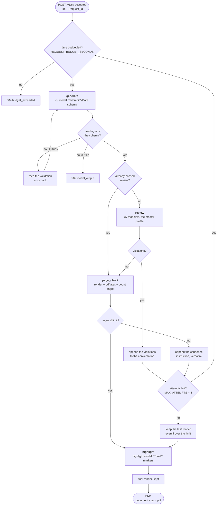
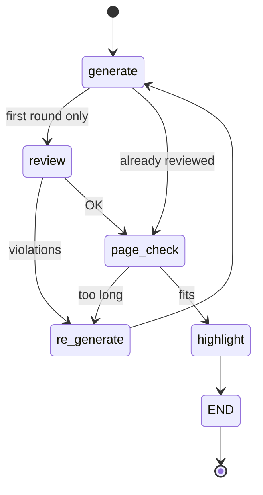

# The CV pipeline

What `POST /v1/cv` does with the minutes it takes: writes the CV, reviews it
against your profile, compiles it, measures it, condenses it until it fits,
highlights the keywords and renders it for good.

The code is `server/src/resumix_server/pipeline/cv_generator.py`
(`CVGenerator.generate`), with the compile and the page count in
`cv_renderer.py`.

## The loop



Three things about that picture are deliberate:

**The render in the middle is the point.** The page limit is enforced by
actually compiling the CV and counting its pages, so the instruction fed back
to the model ("remove 1 duty") is grounded in a real overflow rather
than an estimate.

**That is why the endpoint takes `candidate_data`.** A page count taken with
the contact block missing, or with a different template, is not the page count
of the CV you will send. No model is ever shown `candidate_data` — it goes to
the renderer and nowhere else — but the renderer cannot measure without it.

**The review runs until it passes once.** After that, later attempts only
change length, so re-reviewing would spend a large-model call to re-confirm
what it already said. When it does reject, the reviewer's own words are what
the generator is given next.

## Retries, budgets and what each failure costs

| Guard | Limit | Set by | On exhaustion |
|---|---|---|---|
| Generate → review → page-check rounds | 4 | `RESUMIX_MAX_ATTEMPTS` | `502 model_output` if review never passed; otherwise the last render is kept |
| Schema-validation retries inside one round | 3 | `max_validation_attempts` | `502 model_output` |
| Review parse retries | 2 | fixed | a warning; the CV proceeds as if the review passed |
| Highlight attempts | 2 | fixed | a warning; the un-highlighted CV is returned |
| Wall clock for the whole run | 1200 s | `RESUMIX_REQUEST_BUDGET_SECONDS` | `504`, checked between rounds |
| One `pdflatex` compile | 120 s | `RESUMIX_LATEX_TIMEOUT` | `504 latex_timeout` |

The page limit is therefore best-effort and the review is not: a CV that never
passes review fails the job, while a CV that never fits is delivered at the
length the last attempt reached. If that happens, the log says so on every
round.

## What the client sees while it runs

`GET /v1/cv/{id}/status` answers with the step running now and one line about
the step that just finished. There is no history — poll it, print the status
when it changes, print `detail` when you want to know what it cost.



`re_generate` is spelled `re-generate` on the wire. `detail` is written for a
person and may span several lines: a rejected review quotes the reviewer's
complaints verbatim, and a failed page check quotes the condense instruction
verbatim, because those are the words the model is about to be given.

```json
{"status": "review",
 "detail": "generation finished, tokens used=5341, thinking=610, elapsed=26.6s"}
```

A job that failed answers *here* with the status and cause the work produced —
`502`, `504`, `422` — so a poll is the only call a client has to handle
failure on.

## The condense instruction

When the PDF is too long, the overflow is measured in non-empty text lines on
the pages past the limit, and the instruction scales with it
(`check_pdf_pages`):

| Overflow | What the model is told |
|---|---|
| ≤ 2 lines | Condense the summary, remove 1 duty, cut more than `lines × 90` characters |
| < 15 lines | Condense the summary, remove `(lines+1)/2` duties, cut more than `lines × 90` characters |
| ≥ 15 lines | Serious overflow: remove one work experience completely; aim for 3 experiences, each with its description, and 12 duties in total |

That wording is part of the prompt. Editing it changes what the model
produces.

## The schema is a prompt

`TailoredCVData` (`pipeline/cv_schema.py`) is what the `cv` model is asked to
write, and every `Field(description=...)` in it is restated to the model
inside three prompts — generation, review and highlighting.

| Field | Shape | Notes |
|---|---|---|
| `job_title` | string | Target title, taken from the posting |
| `summary` | string | The professional summary at the top |
| `skills` | 6–8 strings | Prioritised for this posting, grounded in the profile |
| `experiences` | 3–5 objects | `title`, `company`, `location`, `dates`, optional `project_name`, `description` (one line before the duties, counts as one duty), `duties` (at least 1) |
| `certifications` | 0–5 objects | `date`, `name` — most relevant first |

Extra fields are allowed on the way in *and* on the way out: they survive
validation and reach the template.

The bounds are load-bearing: the page limit and the LaTeX template both depend
on them. The model is *asked* for a closed schema (`additionalProperties:
false`, which strict endpoints require) but whatever comes back is validated
by an open model — so a request that brings its own prompt and its own
template can put a new field on the page without the schema in the middle
having to learn about it first.

## What comes back

`GET /v1/cv/{id}` returns `{document, tex, pdf_base64}`.

`document` is one flat object: what the model wrote with your
`candidate_data` merged **over the top**, so a field the model invents can
never replace a real name, email or address. It has no schema of its own —
what the template reads from it is between you and the template. Store it,
edit it, and post it back to `POST /v1/cv/render`, which costs one LaTeX
compile and no model call.

## Rendering

`render_document()` is pure up to the compile: the document is escaped for
LaTeX (including turning `**bold**` into `\textbf{}` and `*italics*` into
`\textit{}`), `generation_date` is added — so re-rendering yesterday's file
dates it today — and Jinja fills the template. The Jinja delimiters are
LaTeX-safe: `\VAR{}`, `\BLOCK{}`, `\#{}`.

Images sent with the request are written next to the `.tex` under exactly the
file name the part carried, because `\includegraphics` resolves relative to
it. One `pdflatex` pass, not two: the shipped template has no `\ref`,
`\label` or `\tableofcontents`, so a second pass would change nothing.

## The other two pipelines

Both are single calls to the `summary` model, and neither has a loop:

- **`jd_validator.detect`** — the free structural checks first (length band,
  no binary payload: `static_jd_guess`, shared with the client), and only if
  they pass does it cost one small model call.
- **`jd_validator.analyze`** — extracts the posting's facts and scores it
  against your profile and your stated preferences. Two attempts, the
  validation error fed back between them.
- **`letter_generator.generate`** — prose in, prose out; 180–450 words,
  validated. When the analysis says the posting is direct from a named
  employer *and* the endpoint supports server-side web search, the model is
  told to research the company; an endpoint that rejects the flag falls back
  to writing without it.
