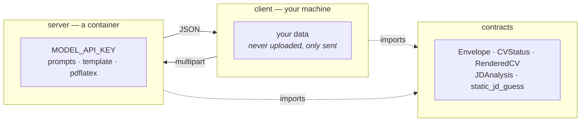
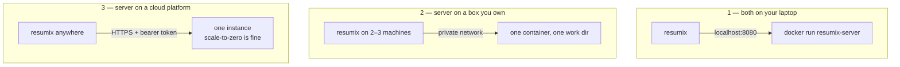

# Running the two halves apart

resumix is deliberately two programs. This page is about where to put each
one, and what the boundary buys you.

## Why they are separate

| | Client | Server |
|---|---|---|
| Holds | your profile, contact data, template, images, the output tree | the provider API key, the prompts, the LaTeX toolchain |
| Costs to install | one file | ~780 MB of TeX Live |
| Wants to be | on the machine you copy postings on | wherever compute is cheap and always on |
| Scales by | being copied | being given more RAM and CPU |

Splitting along that line is what makes each half simple:

- **The key never leaves the server.** A client needs no provider account and
  no `.env`; the one secret it can hold is a bearer token for your own server.
- **Your data never rests on the server.** The profile, the contact details,
  the preferences and the images arrive with each request and are thrown away
  when it ends. There is no database, no accounts, nothing to breach beyond
  the requests currently in flight.
- **Nobody installs LaTeX.** The toolchain, its fonts and its failure modes
  live in one image you did not have to reproduce on Windows.
- **Each half changes on its own.** The wire format is a third package both
  import; `tests/test_architecture.py` fails the build if either side imports
  the other. A new client mode touches no server code, and a new model role
  touches no client code.



## Where to run each



**1 — Both local.** The default. `docker run -p 8080:8080` and
`server_url = "http://localhost:8080"`. No token needed: nothing but your own
machine can reach it. This is also the cheapest way to try a different model —
the container restarts in a second.

**2 — Server on a machine you own.** A NAS, a home server, a spare box. Set
`RESUMIX_API_TOKEN` even here: without it, anyone on the network can spend
your provider credit. Point every client at it with `server_url` in
`resumix.toml`.

**3 — Server on a cloud platform.** Works as-is: the image runs as any uid,
needs no volume, tolerates a read-only root filesystem, and answers `/healthz`
for the platform probe without a token. Three things to get right:

- **Set `RESUMIX_API_TOKEN` and put TLS in front.** The client sends your
  profile and your contact details in the request body.
- **One instance per `RESUMIX_WORK_DIR`, and `WEB_CONCURRENCY=1`.** A job id
  only means something to the process holding its directory. If you must run
  several, give them a shared work root and route by request id.
- **Scale-to-zero is fine, autoscaling is not.** The client knocks on
  `/healthz` three times before its first real call, so a cold start is
  handled — but a request that starts a CV job on one instance and polls
  another gets `404`.

## What the client needs to know

Exactly three things, and only the first is required:

```toml
server_url = "https://resumix.example.run.app"
token      = "the-bearer-token"
timeout    = 1800          # how long to keep polling one CV job
```

or `--server`/`--token`, or `RESUMIX_API_URL`/`RESUMIX_API_TOKEN`. That is
the entire coupling. Everything else the client sends is content.

## Keeping the boundary honest

If you change either half, these are the rules that keep them separable — they
are also what the test suite checks:

- `client → contracts ← server`. Neither side imports the other.
- The contracts package imports pydantic and nothing else. It is loaded by a
  web server *and* by a frozen executable, and has to stay cheap in both.
- No server-side dependency reaches the client: no `openai`, no `jinja2`, no
  `pypdf`, no `fastapi`. `subprocess` is allowed in exactly one file — the
  clipboard helper probe.
- Anything new on the wire goes in `contracts/`, not in a client-side model
  that happens to match.

## Should the repository be split too?

The artifacts are already independent — a container image and an executable,
built by separate CI jobs from disjoint directories. What is shared is the
repository, the lock file and the version number.

Keeping one repository is the better trade today:

- `resumix_contracts` is imported by both halves as a workspace member. Two
  repositories would mean publishing it to an index, or vendoring it twice, to
  buy nothing a directory boundary does not already give.
- A wire change currently lands as one commit that updates both sides and one
  test run that proves they still agree — `tests/test_integration.py` drives
  the real client against the real server app in-process. Split, that becomes
  a release dance across three repositories.
- Both halves are small. The reason to split a repository is that two teams
  keep colliding in it; nothing here collides.

Split it when one of these becomes true, and not before: the client acquires
its own release cadence and users who never touch the server; someone else's
client needs `resumix_contracts` from an index; or the server grows a
private deployment history that should not be in a public client repository.
When that day comes, the seam is already cut — publish `contracts/` as a
versioned package, pin it from both sides, and move the two directories out.
