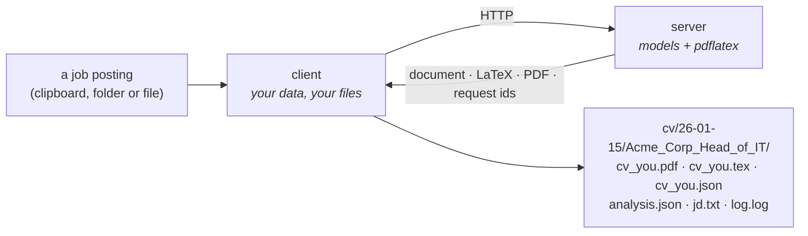

# resumix

Turn a job description and your unstructured experiences into a tailored,
two-page LaTeX CV and a cover letter, using any OpenAI-compatible model.

resumix is two halves that never share a machine by necessity:

- a **server** that holds the model API keys, the prompts and the LaTeX
  toolchain, shipped as a container image;
- a **client** that holds your CV data and your files, shipped as a single
  executable with no Python, no API key and no LaTeX of its own.

They speak HTTP, `multipart/form-data` in and JSON out, over a wire format
both sides import and neither owns.

## Where to start

| If you want to… | Read |
|---|---|
| Understand how the pieces fit | [Architecture](architecture.md) |
| Know how a CV is actually written | [The CV pipeline](cv-pipeline.md) |
| Follow one real run call by call | [A run, end to end](clipboard-flow.md) |
| Use the client | [The client](client.md) |
| Call the server yourself | [The HTTP API](protocol.md) |
| Build or deploy the server | [Building the server](build-server.md) |
| Build the client executable | [Building the client](build-client.md) |
| Decide where each half runs | [Running the two halves apart](deployment.md) |
| Work on resumix itself, in VS Code | [Developing locally in VS Code](development-setup.md) |

## The shape of a run

Your profile, your contact details and your images travel with each request
and are thrown away when it ends. The server keeps no database and no
accounts — only a directory per request, holding that request's log and, for
a CV job, its state and its result.

## The three packages

| | |
|---|---|
| `client/` | The CLI. Watches your clipboard or a folder, keeps your CV data local, files every result in a dated folder. |
| `server/` | The HTTP API. Writes the CV, reviews it, compiles the PDF, analyses postings, writes letters. |
| `contracts/` | The shapes both sides agree on — the one thing each side imports, so neither imports the other. |

The short quickstarts live in the repository's `README.md`, `client/README.md`
and `server/README.md`. These pages are the long form: what the system does,
why it is built this way, and every parameter of both halves.

