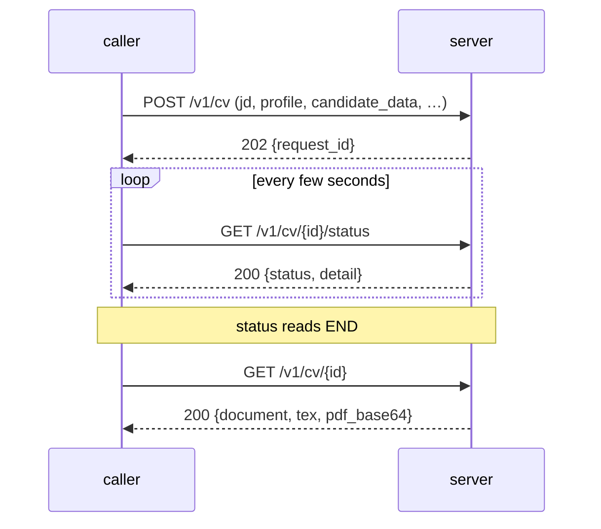

# The HTTP API

Everything is `multipart/form-data` in and JSON out. There is no database and
no accounts: every request carries what it needs and the server throws it away
when the request ends.

Base URL is wherever you run it — `http://localhost:8080` by default. The
interactive OpenAPI page FastAPI generates is at `/docs`.

## Conventions

**Parts.** Every text part can be sent as a file (`-F jd=@JD.txt`) or as a
plain field (`-F jd_text=...`); the file wins if you send both. JSON parts
(`candidate_profile`, `candidate_data`, `document`, `analysis`) must be files,
must parse, and must be JSON *objects*. A UTF-8 BOM is stripped. Any single
part over `RESUMIX_MAX_PART_BYTES` (2 MB) is refused with `413` before it is
read.

**Images.** The `images` part is repeatable, at most 10 per request. Each
part's **file name** is the name the template includes it under — that is the
whole interface. Path components are stripped.

**Auth.** If `RESUMIX_API_TOKEN` is set, every `/v1/...` call and
`/logs/...` must send `Authorization: Bearer <token>`; `/healthz` stays open so
a platform probe works. With no token set, the server is open to anyone who
can reach it, which is only reasonable on a private network.

**The envelope.** Every response, success or failure, has the same shape:

```jsonc
{
  "request_id": "b510f8dff047",   // also in the X-Request-Id header
  "ok": true,
  "data": { },                    // the payload, when ok
  "error": null                   // one line, when not
}
```

Fields that are null are omitted. Nothing else rides on a reply: what the
server *did* is behind `GET /logs/{request_id}`, so the common case pays
nothing for it.

**Request ids.** The server generates a 12-hex-character id per request and
echoes it in the `X-Request-Id` header. An inbound `X-Request-Id` is honoured
if it matches `[A-Za-z0-9_-]{1,64}` — the id names a directory under the work
root, so anything else would be a way to write where the server was not asked
to. Reusing an id that is already in use is a `400`.

## Endpoints at a glance

| Method | Path | Auth | Costs | Returns |
|---|---|---|---|---|
| `GET` | `/healthz` | no | nothing | `ServerStatus` |
| `GET` | `/logs/{request_id}` | yes | nothing | `RequestLog` |
| `POST` | `/v1/jd/detect` | yes | 0–1 small model call | `JDDetection` |
| `POST` | `/v1/jd/analysis` | yes | 1 small model call | `JDAnalysis` |
| `POST` | `/v1/cv` | yes | minutes of model calls | `202` + `request_id` |
| `GET` | `/v1/cv/{id}/status` | yes | nothing | `CVStatus` |
| `GET` | `/v1/cv/{id}` | yes | nothing | `RenderedCV` |
| `POST` | `/v1/cv/render` | yes | one `pdflatex` run | `RenderedCV` |
| `POST` | `/v1/letter` | yes | 1 small model call | `CoverLetter` |

---

## `GET /healthz`

No auth. What this server is and whether it can do its job.

```jsonc
{"request_id": "…", "ok": true, "data": {
  "status": "ok",                 // "degraded" when pdflatex is missing
  "version": "0.2.0",
  "pdflatex": true,
  "models": {"summary": "qwen3.8-flash", "cv": "qwen3.8-max",
             "highlight": "qwen3.8-flash"},
  "auth_required": false
}}
```

## `GET /logs/{request_id}`

What the server did during one request, including a line per model call with
its duration and token counts.

```bash
curl localhost:8080/logs/b510f8dff047
```

```jsonc
{"request_id": "b510f8dff047", "ok": true, "data": {
  "request_id": "b510f8dff047",
  "entries": [{"ts": "2026-01-15T09:30:53", "level": "INFO",
               "stage": "cv.generate",
               "message": "  [cv] qwen-max 41.2s | prompt=7104, completion=1832"}]
}}
```

The log lives in the request's own directory, so a CV job still running
answers with what it has said so far, and a restart does not lose it. `404
unknown_request` means the id was pruned (only the newest 200 are kept), never
did any work — a `400`, `401`, `413` or `429` fails before the pipeline
starts, and its `error` already carries the whole cause — or was served by
another instance.

## `POST /v1/jd/detect`

Is this text a job posting?

```bash
curl -F jd=@JD.txt localhost:8080/v1/jd/detect
```

| Part | | |
|---|---|---|
| `jd` / `jd_text` | required | The text to check |

Structural checks run first — length band (`RESUMIX_JD_MIN_CHARS` …
`_MAX_CHARS`, 1000–10000 by default), no binary payload — and only if they
pass does it cost one small model call. The answer is
`{"is_job_description": true|false}`; why it was rejected is in the request's
log, not in the reply. The same structural check ships in
`resumix_contracts.static_jd_guess`, so a client can run it before spending
the call at all.

## `POST /v1/jd/analysis`

Scores a posting against your profile and extracts its facts.

```bash
curl -F jd=@JD.txt \
     -F candidate_profile=@candidate_profile.json \
     -F pers_preferences=@candidate_preferences.md \
     localhost:8080/v1/jd/analysis
```

| Part | | |
|---|---|---|
| `jd` / `jd_text` | required | The posting |
| `candidate_profile` | required | JSON object: everything you have done |
| `pers_preferences` / `pers_preferences_text` | required | What you want from a job, in prose |
| `temperature` | optional | Sampling temperature |

Returns a `JDAnalysis`:

| Field | Type | |
|---|---|---|
| `match_percentage` | int | 0–100, how well the posting fits the profile |
| `match_rationale` | str? | One line saying why |
| `job_title` | str | As extracted from the posting |
| `work_location` | str? | e.g. `"Milan, Italy"` |
| `work_mode` | str | `full_remote` \| `hybrid` \| `on_site` \| `not_specified` |
| `expected_salary` | str? | As stated, e.g. `"EUR 60k-80k"` |
| `max_salary` | int? | Upper bound, or `-1` if not found |
| `experience_level` | enum | `entry_level` \| `intermediate` \| `professional` \| `manager` \| `director` |
| `hard_skills`, `soft_skills` | str[] | Up to 4 each |
| `company_name` | str | The employer, or the agency |
| `posting_type` | str | `direct` \| `headhunter` |
| `posting_url` | str? | If the posting text carries one |
| `gaps` | str | Where you fall short of the posting |
| `pers_preferences` | str | How the posting reads against your preferences |
| `pers_preference_score` | float | The summed score of the preferences it satisfies |

`posting_type` is load-bearing beyond the report: `direct` plus a named
company is what lets the letter endpoint spend a web search.

## `POST /v1/cv` → `GET /v1/cv/{id}/status` → `GET /v1/cv/{id}`

The expensive one: minutes of model calls. It does not wait.



```bash
ID=$(curl -s -F jd=@JD.txt \
          -F candidate_profile=@candidate_profile.json \
          -F candidate_data=@candidate_data.json \
          localhost:8080/v1/cv | jq -r .request_id)

curl -s localhost:8080/v1/cv/$ID/status    # every few seconds
curl -s localhost:8080/v1/cv/$ID > cv.json # once it says END
```

### `POST /v1/cv`

| Part | | |
|---|---|---|
| `jd` / `jd_text` | required | The posting |
| `candidate_profile` | required | JSON object — what the model tailors from |
| `candidate_data` | required | JSON object — what the template prints |
| `sys_prompt_cv`, `sys_prompt_highlight`, `sys_prompt_review` | optional | Replace a prompt for this request |
| `template` | optional | Replace `resume.tex.jinja`, page checks included |
| `images` | optional | Repeatable, ≤10. Each part's file name is the name the template includes it under. |
| `temperature` | optional | Sampling temperature |
| `pages` | optional | Page limit the CV must fit. Default 2, minimum 1. |

Answers `202` with `{"request_id": "…", "ok": true}` and no `data`. The id is
the job's handle for everything below.

**Why `candidate_data` is required.** The page limit is enforced by actually
compiling the CV and counting the pages, so the instruction fed back to the
model is grounded in a real overflow. A page count taken with the contact
block missing is not the page count of the CV you will send. No model is shown
`candidate_data`: it goes to the renderer and nowhere else.

### `GET /v1/cv/{id}/status`

```jsonc
{"request_id": "b510f8dff047", "ok": true, "data": {
  "status": "review",
  "detail": "generation finished, tokens used=5341, thinking=610, elapsed=26.6s"
}}
```

`status` is one of `generate`, `review`, `re-generate`, `page_check`,
`highlight`, `END`. There is no history: poll it, print the status when it
changes, print `detail` when you want to know what it cost. `detail` is
written for a person and may span several lines — a rejected review quotes the
reviewer's complaints verbatim, and a failed page check quotes the condense
instruction verbatim, because those are the words the model is about to be
given.

**A failed job reports itself here**, with the status and cause the work
produced (`502`, `504`, `422`) and the job's own request id in the body — so a
poll is the only call a client has to handle failure on. See
[the CV pipeline](cv-pipeline.md) for what each step does.

### `GET /v1/cv/{id}`

The finished CV.

```jsonc
{"request_id": "b510f8dff047", "ok": true, "data": {
  "document": { },        // the merged CV content
  "tex": "\\documentclass…",
  "pdf_base64": "JVBERi0…"
}}
```

`409 job_not_ready` while the job is still running; `404 unknown_request` once
its directory has been pruned.

`document` is one flat object — what the model wrote with your
`candidate_data` merged over the top, so a field the model invents can never
replace a real contact detail. It has no schema: what the template reads from
it is between you and the template. Store it, edit it, post it back to
`/v1/cv/render`.

## `POST /v1/cv/render`

```bash
curl -F document=@cv.json     localhost:8080/v1/cv/render
curl -F tex=@cv_edited.tex    localhost:8080/v1/cv/render
```

| Part | | |
|---|---|---|
| `document` | one of the two | A CV document as JSON — what `GET /v1/cv/{id}` returned, or anything else your template can read |
| `tex` | one of the two | Ready LaTeX, compiled as-is |
| `template` | optional | Replace `resume.tex.jinja` |
| `images` | optional | Repeatable, ≤10 |

Sending both, or neither, is a `400`. Returns `{tex, pdf_base64}`; `document`
is not echoed back, because whoever asked for the render already has it.
Cheap and deterministic: editing the content and re-rendering never costs a
model call.

The rendered `.tex` is dated at render time, so re-rendering yesterday's
document dates it today.

## `POST /v1/letter`

```bash
curl -F jd=@JD.txt -F candidate_profile=@candidate_profile.json \
     -F candidate_data=@candidate_data.json \
     -F analysis=@analysis.json localhost:8080/v1/letter
```

| Part | | |
|---|---|---|
| `jd` / `jd_text` | required | The posting |
| `candidate_profile` | required | JSON object |
| `candidate_data` | required | JSON object — the header block's name, email, phone, LinkedIn |
| `analysis` | optional | A `JDAnalysis` — makes the letter more targeted, and enables the web research |
| `sys_prompt_letter` | optional | Replace the letter prompt |
| `temperature` | optional | Sampling temperature |

Returns `{"text": "…", "words": 312}`, validated between 180 and 450 words.
When the analysis says the posting is direct from a named employer *and* the
endpoint supports server-side web search, the model is told to research the
company; an endpoint that rejects the flag falls back to writing without it.

---

## Errors

A failed request returns the same envelope with `ok: false` and one line
saying what went wrong, its kind and its stage:

```json
{"request_id": "b510f8dff047", "ok": false,
 "error": "model_output [cv.generate]: No CV passed review in 4 attempts."}
```

| Status | Kind | Means |
|---|---|---|
| `400` | `bad_request`, `missing_part`, `bad_part` | A required part is absent, empty, not UTF-8, not JSON, not an object, or mutually exclusive parts were both sent |
| `401` | `unauthorized` | `RESUMIX_API_TOKEN` is set and the request had no matching token. Answers with `WWW-Authenticate: Bearer` |
| `404` | `unknown_request` | The id was pruned, never did any work, or another instance served it |
| `409` | `job_not_ready` | The CV job is still running — poll `/status` until it says `END` |
| `413` | `part_too_large` | A part exceeded `RESUMIX_MAX_PART_BYTES` |
| `422` | `latex_compile` | The template or the `.tex` does not compile. The TeX log tail is in `/logs/{id}` |
| `422` | `validation_error` | An uploaded document does not match the expected schema |
| `429` | `too_many_jobs` | All job slots are busy. Answers with `Retry-After: 30` |
| `502` | `model_output` | The model never produced usable output within the attempts allowed |
| `502` | `provider_error`, `provider_unreachable` | The model endpoint failed. The body is never echoed — it can carry the endpoint and the key |
| `504` | `latex_timeout`, `budget_exceeded`, `provider_timeout` | A compile, the whole run, or the provider hit its timeout |
| `500` | `internal_error` | A bug here. Everything else above is an answer, not a crash |

The stage in brackets (`[cv.generate]`, `[compile]`, `[render]`) says where in
the pipeline it happened. For the attempts that led there — including every
failed one, with its token cost — fetch `GET /logs/{request_id}`.

## The wire format as a package

`resumix_contracts` is the same set of pydantic models the server answers
with, published as its own package so a client can import it instead of
hand-rolling the shapes:

```python
from resumix_contracts import (
    Envelope, CVStatus, RenderedCV, CoverLetter, ServerStatus,
    JDAnalysis, JDDetection, RequestLog, LogEntry, static_jd_guess,
)

envelope = Envelope[RenderedCV].model_validate(response.json())
pdf_bytes = envelope.data.pdf_bytes()          # decodes pdf_base64
```

It depends on pydantic and nothing else. The CV document itself deliberately
has no model there: it is whatever the CV model wrote merged with whatever
your `candidate_data.json` holds, and only your LaTeX template has an opinion
about it.
