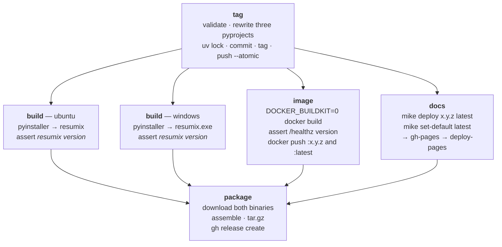

# Cutting a release

One version for the whole repository, and one thing you type. Actions →
**Release** → *Run workflow* → `0.3.0` → *Run*. Nothing happens on your
machine.

`.github/workflows/release.yml` writes that number into the three
`pyproject.toml` files and `uv.lock`, commits it, tags `v0.3.0`, and builds
everything from that tag: one `.tar.gz` on the release page, the server image
on Docker Hub, and this site under its own version.

## Before the first one

Two repository secrets, set once under *Settings → Secrets and variables →
Actions*:

| Secret | What it is |
|---|---|
| `DOCKERHUB_USERNAME` | The Docker Hub account that owns `lmstch/resumix`. |
| `DOCKERHUB_TOKEN` | An access token for it, not the account password. |

Without them the `image` job fails at `docker login`, after the image has been
built and checked — and because `package` waits on every job, no release is
published until they exist.

**GitHub Pages**, once, under *Settings → Pages*: source **GitHub Actions**.
Not *Deploy from a branch* — `gh-pages` is still where every version is kept,
but the `docs` job uploads that branch and deploys it itself. Choosing the
branch instead hands publishing to the build Pages runs on a push, and that
build never fires here: mike pushes as `github-actions[bot]`, and a
`GITHUB_TOKEN` push starts no workflow run. The branch would move and the
site would not. Nothing else writes that branch — it belongs to mike.

One consequence worth knowing: with this source, pushing `gh-pages` by hand
publishes nothing. A `mike deploy --push` from a laptop updates the store and
leaves the site where it was. Releasing is what publishes.

The workflow also declares `permissions: contents: write`. The repository
default for `GITHUB_TOKEN` is read-only, and this workflow pushes a commit, a
tag and a release; without that block the push is refused with a 403. The
`docs` job asks for two more of its own — `pages: write` and `id-token: write`
— because it deploys the site rather than leaving that to a branch build.

## Running it

Type the number bare: `0.3.0`, not `v0.3.0`. The tag gets the `v`.

It refuses, before writing anything, when:

| Refusal | Why |
|---|---|
| the version is not `MAJOR.MINOR.PATCH` | the tag, the archive name and the image tag are all built from it |
| you dispatched from a branch other than `main` | a release that is not on the main line is a release nobody can reconstruct |
| `v<version>` is already on the remote | re-releasing a version silently is how two different binaries end up with one number |

## What happens



**The tag is pushed first, before anything is built.** That order is forced:
the binaries have to carry the version, so the bump has to precede the build,
and the build jobs can only check out a commit that exists on the remote. Every
"tag last" arrangement ends up shipping the bump as a patch and re-applying it
in three jobs — more moving parts for the same result.

`package` waits for every other job, so the release page never announces a
version whose server image is not on Docker Hub or whose docs are not up. The
image job logs in to the registry *after* the build and the health check, so a
broken image never gets as far as authenticating.

## Where the version lives

There is no `__version__` string in the source to forget to bump. One number is
written in one place and everything else reads it:

| Where | Who writes it |
|---|---|
| `contracts/`, `server/`, `client/` `pyproject.toml` | the workflow, with `sed` |
| `uv.lock` | `uv lock`, in the same commit |
| `resumix version`, and every `--verbose` run | `importlib.metadata.version("resumix-client")` |
| `/healthz` and the OpenAPI document | `importlib.metadata.version("resumix-server")` |

`uv.lock` is in that list because it records each workspace member's version
as well. A bump that did not regenerate it would commit a lock that disagrees
with the manifests, which `uv lock --check` and `uv sync --locked` both refuse.
The binaries themselves would still be right — `uv sync --frozen` builds the
workspace members from source, so the manifest wins — but a repository whose
lock contradicts its manifests is a trap for the next person.

What guards the version in the artefacts is not the lock but the assertions:
both build jobs run `resumix version` on the binary they just produced, and the
image job reads `/healthz` from the container it just built, before any of it
is published.

## What gets published

| Artifact | Where | Name |
|---|---|---|
| both executables and the files beside them | the release page | `resumix-x.y.z.tar.gz` |
| the server image | Docker Hub | `lmstch/resumix:x.y.z` and `:latest` |
| this site | GitHub Pages, from `gh-pages` | `/x.y.z/`, and `/latest/` which `/` redirects to |

The archive is flat on purpose:

```text
resumix                      the Linux executable, already +x
resumix.exe                  the Windows executable
README.md                    the client README, links rewritten for this layout
resumix.toml                 points at http://localhost:8080; edit it
candidate_profile.json       the fictional set, ready to edit
candidate_data.json
candidate_preferences.md
candidate_signature.png
posting.txt                  something to try it on
```

The client looks for its files **by name in the folder you run it in** — see
`discovery.py` — so a flat archive is a working folder as soon as it is
extracted. There is nothing to move and no config to rename:

```bash
mkdir resumix && tar xzf resumix-0.3.0.tar.gz -C resumix
cd resumix
./resumix submit-raw posting.txt --server https://your-server
```

Extract it into a folder of its own, as above. A flat archive unpacks nine
files wherever you stand.

## The site's own versions

`mike` keeps one built copy of `doc/` per release on the `gh-pages` branch,
plus a `versions.json` that the selector in the header reads:

```text
gh-pages/
├── 0.2.0/           one full site per release
├── 0.3.0/
├── latest/          an alias, moved by --update-aliases
├── versions.json    what the selector offers
└── index.html       redirects / to latest/
```

The docs version is the release version, in full — `0.3.0`, not `0.3`. mike's
own convention is major.minor, so that patches share a docs version, but one
number for the whole repository is worth more here than a shorter selector: a
tag, an archive, an image tag and a docs URL that all read `0.3.0` need no
explaining.

`mike set-default --push latest` runs on every release. It is idempotent, and
doing it every time is what lets the first release set the redirect up with no
manual step.

Locally, `mkdocs serve` and `mkdocs build` are unchanged and unversioned. The
selector is built at runtime from a `versions.json` that only the published
site has, so it will not appear in a local preview — that is expected, not a
misconfiguration.

## When it fails

| What failed | What is left behind | What to do |
|---|---|---|
| `tag` | nothing — the branch and the tag are pushed with `--atomic`, so they land together or not at all | fix it and dispatch again |
| a later job, transiently — a runner flake, a registry 5xx | the bump commit and the tag, no release | **Re-run failed jobs**. `tag` is skipped and its `sha` output carries over, so the re-run builds the same commit. |
| a later job, for a real reason — the Windows build broke, the image fails its health check, a doc link is dead | the same | the release was never valid. Fix it on `main` and release the next patch number. |

`docs` and `image` both publish before `package` does, so a failure after them
can leave a site and an image for a version that has no release page. Both are
safe to redo: `mike deploy` overwrites the version's directory, and
`docker push` overwrites the tag.

The last row is the one that looks wrong and is not. Tags are free, a skipped
patch number costs nothing, and the alternative — teaching the workflow to
delete and re-push its own tag — is a feature nobody asked for that can destroy
a good release.

One thing worth knowing: **the release commit does not run CI.** Pushes made
with `GITHUB_TOKEN` do not trigger further workflow runs. Its only difference
from `main` is three version strings and the lock, and both `uv sync --frozen`
and the Docker build fail loudly on a broken lock — but the rule that follows
from it is: **release only from a green `main`.**
